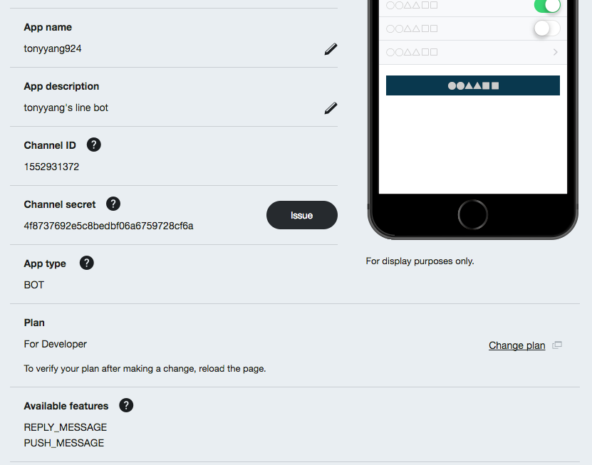
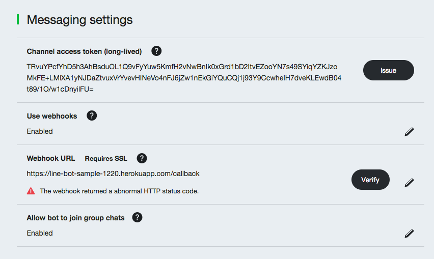
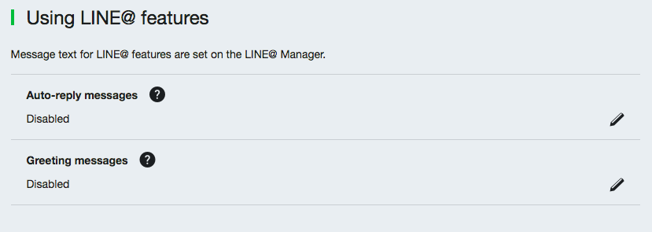
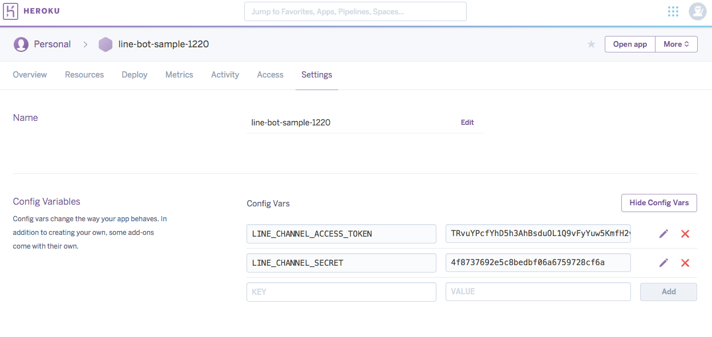

# 使用Python Flask 撰寫 Line Bot 
<small style="vertical-align:middle;display:inline-block"><iframe src="http://ghbtns.com/github-btn.html?user=tonyyang924&type=follow" allowtransparency="true" frameborder="0" scrolling="0" width="170" height="20" style="width:170px;height:20px;  background-color: transparent;"></iframe></small>

# 環境安裝

## Install Python & SDK & dependency 
----
* Python Install
<pre><code class="markdown">brew install python3 # this installs python only brew postinstall python3 # this command installs pip</code></pre>

* SDK install
<pre><code class="markdown">pip3 install line-bot-sdk</code></pre>

* Dependency
<pre><code class="markdown">wget https://raw.githubusercontent.com/tonyyang924/mudhorse-line-bot/master/requirements.txt
pip install -r requirements.txt</code></pre>

# 撰寫Python後端程式

## Code
<pre><code class="python">
import os
from flask import Flask, request, abort

from linebot import (
    LineBotApi, WebhookHandler
)
from linebot.exceptions import (
    InvalidSignatureError
)
from linebot.models import (
    MessageEvent, TextMessage, TextSendMessage,
)

app = Flask(__name__)

# get channel_secret and channel_access_token from your environment variable
channel_secret = os.getenv('LINE_CHANNEL_SECRET', None)
channel_access_token = os.getenv('LINE_CHANNEL_ACCESS_TOKEN', None)
if channel_secret is None:
    print('Specify LINE_CHANNEL_SECRET as environment variable.')
    sys.exit(1)
if channel_access_token is None:
    print('Specify LINE_CHANNEL_ACCESS_TOKEN as environment variable.')
    sys.exit(1)

line_bot_api = LineBotApi(channel_access_token)
handler = WebhookHandler(channel_secret)

@app.route("/callback", methods=['POST'])
def callback():
    # get X-Line-Signature header value
    signature = request.headers['X-Line-Signature']

    # get request body as text
    body = request.get_data(as_text=True)
    app.logger.info("Request body: " + body)

    # handle webhook body
    try:
        handler.handle(body, signature)
    except InvalidSignatureError:
        abort(400)

    return 'OK'
</code></pre>

<pre><code class="python">
@handler.add(MessageEvent, message=TextMessage)
def handle_message(event):
    line_bot_api.reply_message(
        event.reply_token,
        TextSendMessage(text=event.message.text))

if __name__ == "__main__":
    app.run()
</code></pre>

# Deploy to Heroku

## Prerequisites: Installing Git and the Heroku CLI
* [Git installation instructions](https://git-scm.com/book/en/v2/Getting-Started-Installing-Git)
* [Heroku CLI installation instructions](https://devcenter.heroku.com/articles/heroku-cli)

## Tracking your app in Git
<pre><code class="terminal">
$ mkdir LineBotSample
$ git init
$ mvim app.py
$ wget https://raw.githubusercontent.com/tonyyang924/mudhorse-line-bot/master/Procfile
$ wget https://raw.githubusercontent.com/tonyyang924/mudhorse-line-bot/master/requirements.txt
$ git add . 
$ git commit -m "first commit"
</code></pre>

## Creating a Heroku remote
<pre><code class="terminal">
$ heroku create line-bot-sample-1220
Creating ⬢ line-bot-sample-1220... done
https://line-bot-sample-1220.herokuapp.com/ | https://git.heroku.com/line-bot-sample-1220.git
$ git remote -v
heroku	https://git.heroku.com/line-bot-sample-1220.git (fetch)
heroku	https://git.heroku.com/line-bot-sample-1220.git (push)
</code></pre>

## Deploying code
<pre><code class="terminal">
$ git push heroku master
Counting objects: 3, done.
Delta compression using up to 4 threads.
Compressing objects: 100% (2/2), done.
Writing objects: 100% (3/3), 646 bytes | 646.00 KiB/s, done.
Total 3 (delta 0), reused 0 (delta 0)
remote: Compressing source files... done.
remote: Building source:
remote:
remote: -----> Python app detected
....
remote:
remote: -----> Discovering process types
remote:        Procfile declares types -> (none)
remote:
remote: -----> Compressing...
remote:        Done: 53.7M
remote: -----> Launching...
remote:        Released v3
remote:        https://line-bot-sample-1220.herokuapp.com/ deployed to Heroku
remote:
remote: Verifying deploy... done.
To https://git.heroku.com/line-bot-sample-1220.git
 * [new branch]      master -> master
</code></pre>

# Line manage setting

# Heroku setting

## QR Code

## Reference
* https://github.com/line/line-bot-sdk-python
* https://github.com/twtrubiks/line-bot-tutorial
* https://devcenter.heroku.com/articles/git